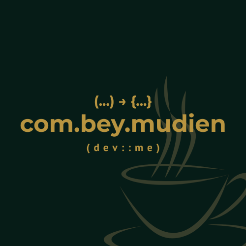

>  Where creativity flows through every line of code.

>  When logic meets imagination in perfect harmony,

>  Innovation is no longer a goal—it becomes a way of life.

>  Each bug a mystery, each fix a triumph.

>    This is where ideas come alive,

>   One keystroke at a time.

 

# 👋 Hi, I'm Ubay Lahmudien!

**Software Developer** | **Server-side Engineer**

Saya adalah seorang developer yang suka membangun sistem backend yang andal dan efisien. Saya senang mengeksplorasi teknologi baru, menyelesaikan masalah teknis yang menantang, dan selalu terbuka untuk berkolaborasi dalam membangun solusi yang berdampak nyata.

---

## 💡 Sedikit Tentang Saya

- 🧠 Belajar secara otodidak & terus berkembang
- 🔌 Tertarik pada integrasi sistem dan API
- 📈 Suka menulis kode bersih & scalable
- 🤝 Terbuka untuk kolaborasi open-source dan project freelance

---

## 🚀 Tech Stack

### 🛠 Backend

### 🌐 Frontend

> I'm not a dedicated frontend developer, but I have hands-on experience building interfaces using these tools.

### 🗄️ Database

### 💻 Programming Languages

---

## 🤝 Let’s Connect

### Bagaimana Anda bisa berkomunikasi dengan saya:

> Saya akan senang jika diajak kolaborasi atau berdiskusi seputar pengembangan web, pemrograman, atau proyek-proyek teknologi lainnya.  
> Jangan ragu untuk menghubungi saya — saya terbuka untuk peluang belajar dan berkembang bersama! 🚀

---

😄 Terima kasih telah mengunjungi profil saya!
---

> **NB** : Dont Forget A Cup of Coffee Today

---

